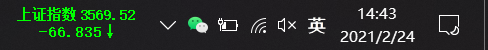
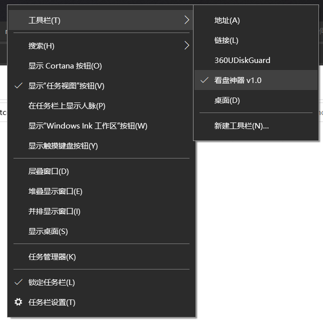
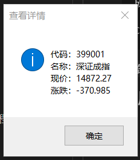
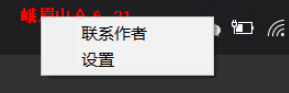
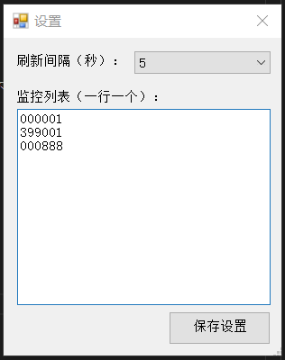

## StockWatcher

An simple, useful stock watcher windows deskband. 
一个简单实用的股票看盘神器，windows 任务栏工具。

## 预览





## 安装

1、必须安装 .NET framework 4.0，默认 Win7 操作系统以上已经安装，无需安装。

2、下载 [https://github.com/mrhuo/StockWatcher/app](https://github.com/mrhuo/StockWatcher/app) 下的软件。

3、在软件保存目录用 **管理员权限** 打开 `cmd.exe`。

> 注意，一定要管理员权限打开，否则无法安装或卸载。任务栏工具相当于给 `explorer.exe` 进程安装插件，所以需要管理员权限才可操作。安装杀毒软件的话，可能会报无权限操作，允许即可。

4、执行如下命令：

```
C:\>StockWatcher.exe
Windows 任务栏看盘神器 v1.0
Email：admin@mruo.com

使用方法：
    StockWatcher.exe i  安装组件
    StockWatcher.exe u  卸载组件
```

可以看到直接执行会出现帮助信息。

#### 安装软件

```
C:\>StockWatcher.exe i
Windows 任务栏看盘神器 v1.0
Email：admin@mruo.com

Microsoft Windows [版本 10.0.19042.804]
(c) 2020 Microsoft Corporation. 保留所有权利。

C:\>Succesfully registered deskband `看盘神器 v1.0` - GUID: {efd26d5d-1609-4b8a-b51c-843bb9dfd2be}
Request to show deskband.
The deskband was Succesfully shown with taskbar.
You may see the alert notice box from explorer call.
成功注册了类型
```

#### 卸载软件

```
C:\>StockWatcher.exe u
Windows 任务栏看盘神器 v1.0
Email：admin@mruo.com

Microsoft Windows [版本 10.0.19042.804]
(c) 2020 Microsoft Corporation. 保留所有权利。

C:\>Successfully unregistered deskband `看盘神器 v1.0` - GUID: {efd26d5d-1609-4b8a-b51c-843bb9dfd2be}
成功注销了类型

C:\>成功: 已终止进程 "explorer.exe"，其 PID 为 2128。
```

> 卸载软件会重启桌面进程 `explorer.exe`，这样保证桌面进程不再继续占用该软件进程。

## 使用

1、双击任务栏盘面信息，显示当前股票信息。



2、右键任务栏盘面信息，出现操作菜单。



3、设置界面



## 计划

1. 双击盘面时显示整体行情列表。
2. 加入提醒。